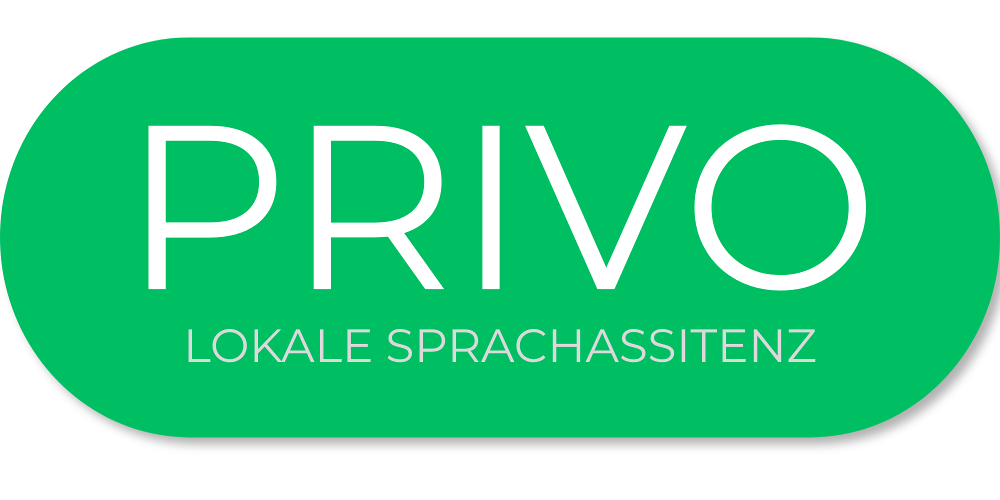

<p align="center">
  
</p>

# 🧠 Offline-Sprachassistent – Prototyp

## 📌 Übersicht

Dieser Prototyp wurde im Rahmen der Bachelorarbeit zum Thema  
**„Privacy by Design: Entwicklung und Bewertung eines Offline-Sprachassistenten als Alternative zu Cloud-basierten Systemen“** entwickelt.

**Privo** ist ein modular aufgebauter Sprachassistent, der vollständig **lokal (offline)** arbeitet.
Alle Verarbeitungsschritte – von der Audioaufnahme bis zur Antwortausgabe – erfolgen direkt auf dem Endgerät, ohne externe Server oder Cloud-Dienste zu verwenden und ohne Informationen länger als ein Gespräch zu speichern.

👉 Ziel ist es, eine **datenschutzfreundliche** Alternative zu Systemen wie Amazon Alexa oder Google Assistant zu schaffen.

## 🎯 Zielsetzung

- Entwicklung eines vollständig offlinefähigen Sprachassistenten
- Umsetzung des Konzepts Privacy by Design
- Vermeidung jeglicher Cloud-Kommunikation
- Aufbau einer modularen, erweiterbaren Architektur
- Evaluation hinsichtlich:
  - Datenschutz
  - Performance (Latenz, Durchsatz)
  - Nutzererlebnis

## ⚙️ Funktionen

Der Prototyp unterstützt aktuell folgende Funktionen:

- 🗣️ **Wakeword-Erkennung (OpenWakeWord)**  
  Aktivierung des Sprachassistenten durch ein definiertes Wakeword

- 🎙️ **Spracherkennung (Faster-Whisper)**  
  Lokale Umwandlung von Sprache in Text

- 🧠 **LLM-Verarbeitung (llama.cpp + Qwen 2.5)**  
  Antwortgenerierung basierend auf ausgewählten lokalen LLM-Modellen

- 🔊 **Sprachausgabe (Piper)**  
  Lokale Generierung gesprochener Antworten

- 📊 **Benchmark-Modul**  
  Durchführung von Messungen zur Bewertung von Latenz, Verarbeitungszeit und Ressourcenverbrauch einzelner Verarbeitungsschritte

- 🐞 **Debugger**  
  Speicherung und Ausgabe von Debug-Informationen, um Abläufe, Fehler und Zwischenergebnisse während der Entwicklung nachvollziehbar zu machen

## 🏗️ Architektur

Der Prototyp besteht aus mehreren Modulen:

1. **Audio-Input** – Aufnahme von Sprache über das Mikrofon
2. **Wakeword-Modul** – Erkennung des definierten Aktivierungswortes
3. **Utterance-Recorder** – Aufnahme der Nutzereingabe, bis keine Sprache mehr erkannt wird
4. **Speech-to-Text-Modul** – Lokale Transkription der aufgenommenen Sprache
5. **LLM-Modul** – Lokale Antwortgenerierung
6. **Text-to-Speech-Modul** – Umwandlung der Antwort in Sprache

Alle Komponenten arbeiten vollständig lokal auf dem Gerät.

## 💻 Installation

### Voraussetzungen

- Python 3.11
- Mikrofon
- Unterstütztes Betriebssystem:
  - Windows
  - Linux
  - macOS
- C/C++-Compiler bzw. Build-Tools:
  - **macOS:** Xcode bzw. Xcode Command Line Tools
  - **Windows:** Visual Studio Build Tools oder MinGW
  - **Linux:** GCC oder Clang
- Optional bei NVIDIA-Grafikkarten:
  - CUDA-Treiber bzw. CUDA Toolkit für GPU-beschleunigte Whisper-Berechnung

### Setup

```bash
pip install git+https://github.com/USERNAME/privo.git
```

Danach den Setup-Assistenten starten:

```bash
privo install
```

Damit werden einmalig die benötigten lokalen Modelle heruntergeladen.

Der Privo kann dann mit

```bash
privo run
```

gestartet werden.

## 📊 Evaluation

Im Rahmen der Bachelorarbeit wird der Prototyp hinsichtlich folgender Kriterien bewertet:

- Datenschutzvorteile gegenüber Cloud-Lösungen
- Erkennungsgenauigkeit
- Reaktionszeit
- Ressourcenverbrauch

Das Benchmark-Modul unterstützt diese Evaluation, indem es definierte Testabläufe ausführt und Messwerte zur Performance des Systems erfasst.

## ⚠️ Einschränkungen

- Hardwareabhängige Performance
- Lokale Modelle benötigen je nach Größe ausreichend Speicherplatz und Arbeitsspeicher
- GPU-Beschleunigung ist optional, kann die Verarbeitungsgeschwindigkeit jedoch deutlich verbessern
- Den Sprachassistenten auf Englisch zu betreiben verbessert die LLM-Antwort und SST-Ausgabe wesentlich

## Lizenz

Der Quellcode von Privo steht unter der Apache License 2.0.

Externe Modelle und Bibliotheken unterliegen jeweils ihren eigenen Lizenzen. Die mitgelieferten oder herunterladbaren Modelle sind nicht automatisch von der Apache-2.0-Lizenz dieses Projekts abgedeckt. Bitte beachte die jeweiligen Lizenzbedingungen der Modellanbieter.

## 👨‍💻 Autor

Prototyp zur Bachelorarbeit von:
Moritz Rühm
